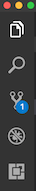
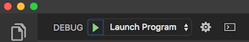

# Full Stack Chess

Full Stack Chess is an application where users can play chess against eachother and chat during the game. Check it out at https://full-stack-chess-e9c4d20248be.herokuapp.com/ !

This version uses React, Redux, Express, Passport, Chess.js, React-Chessboard, Socket.io, and PostgreSQL (a full list of dependencies can be found in `package.json`).

## Prerequisites

Before you get started, make sure you have the following software installed on your computer:

- [Node.js](https://nodejs.org/en)
- [PostgreSQL](https://www.postgresql.org)
- [Nodemon](https://nodemon.io)

## Create Database and Table

Create a new database called `full-stack-chess` and create `user`,`games`, and `chat` tables:

```SQL
CREATE TABLE "user" (
    "id" SERIAL PRIMARY KEY,
    "username" VARCHAR (80) UNIQUE NOT NULL,
    "password" VARCHAR (1000) NOT NULL
);
```

```SQL
CREATE TABLE "games" (
	"id" SERIAL PRIMARY KEY,
	"in_progress" BOOLEAN DEFAULT true,
	"room_id" VARCHAR (80) UNIQUE NOT NULL,
	"white" INT REFERENCES "user",
	"black" INT REFERENCES "user",
	"position" VARCHAR(1000) DEFAULT 'start',
	"turn" VARCHAR(1) DEFAULT 'w',
	"outcome" VARCHAR(50)
	);
```

```SQL
CREATE TABLE "chat" (
	"id" SERIAL PRIMARY KEY,
	"room_id" VARCHAR(80),
	"user" VARCHAR(80),
	"message" VARCHAR(500)
	);
```

Run this after setting up the tables and registering an account: 

```SQL
INSERT INTO "games" (room_id, black) VALUES ('room', 1);
```


## Development Setup Instructions

- Run `npm install`.
- Create a `.env` file at the root of the project and paste this line into the file:

```plaintext
SERVER_SESSION_SECRET=superDuperSecret
```

While you're in your new `.env` file, take the time to replace `superDuperSecret` with some long random string like `25POUbVtx6RKVNWszd9ERB9Bb6` to keep your application secure. Here's a site that can help you: [Password Generator Plus](https://passwordsgenerator.net). If you don't do this step, create a secret with less than eight characters, or leave it as `superDuperSecret`, you will get a warning.

- Start postgres if not running already by using opening up the [Postgres.app](https://postgresapp.com), or if using [Homebrew](https://brew.sh) you can use the command `brew services start postgresql`.
- Run `npm run server` to start the server.
- Run `npm run client` to start the client.
- Navigate to `localhost:5173`.

## Debugging

To debug, you will need to run the client-side separately from the server. Start the client by running the command `npm run client`. Start the debugging server by selecting the Debug button.



Then make sure `Launch Program` is selected from the dropdown, then click the green play arrow.



## Testing Routes with Postman

To use Postman with this repo, you will need to set up requests in Postman to register a user and login a user at a minimum.

Keep in mind that once you using the login route, Postman will manage your session cookie for you just like a browser, ensuring it is sent with each subsequent request. If you delete the `localhost` cookie in Postman, it will effectively log you out.

1. Run `npm run server` to start the server.
2. Import the sample routes JSON file [v2](./PostmanPrimeSoloRoutesv2.json) by clicking `Import` in Postman. Select the file.
3. Click `Collections` and `Send` the following three calls in order:
   1. `POST /api/user/register` registers a new user, see body to change username/password.
   2. `POST /api/user/login` will login a user, see body to change username/password.
   3. `GET /api/user` will get user information, by default it's not very much.

After running the login route above, you can try any other route you've created that requires a logged in user!

## Update Documentation

Customize this ReadMe and the code comments in this project to read less like a starter repo and more like a project. Here is an example: https://gist.github.com/PurpleBooth/109311bb0361f32d87a2.
